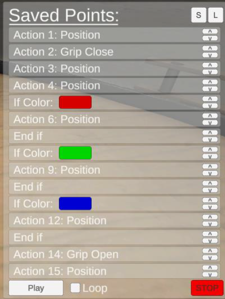
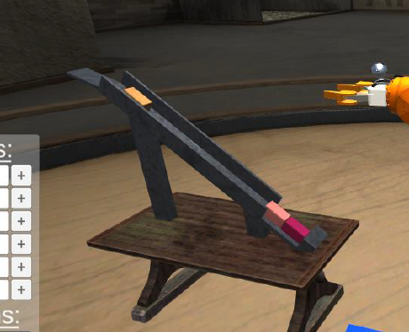
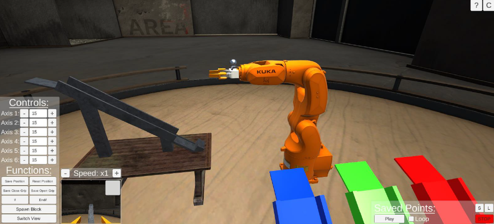

# KUKA Arm Simulation

This C# project is a Unity-based simulation of a KUKA robotic arm equipped with a gripper and a camera. The arm automatically sorts coloured blocks by picking and placing them into designated areas based on their colour, demonstrating foundational robotics, automation, and computer vision concepts.

Originally conceptualized for physical hardware integration, the project was strategically pivoted to a Unity 3D simulation to overcome unforeseen hardware and time constraints, resulting in a robust, versatile virtual testing environment.

## Features
- Simulates a 6-axis KUKA robotic arm with realistic movement
- Functional gripper for picking and placing blocks
- Camera system for colour detection and sorting
- Automatic and manual control modes
- Block spawning and colour-based sorting
- User interface for controlling and monitoring the simulation

## Demo
**[Download the built version](https://drive.google.com/file/d/15pb26KJ1cmQXRvF5crCmAyVF-gdmzCSW/view?usp=sharing)**

## Screenshots
<!-- Add screenshots of the simulation here -->

 
Instructions for the arm and mounted camera can be saved and loaded
 
 

 
Randomly coloured blocks are spawned on a chute and fed towards the arm and mounted camera
 
 

 
The full scene showing the block chute, arm, and the stacks that the blocks are sorted into based on their colour
 

## Requirements
- Unity Editor **2021.2.0f1** (or compatible with minor adjustments)
- Windows OS recommended
- Dependencies managed via Unity Package Manager (see `Packages/manifest.json`)

## Setup Instructions
1. Clone or download this repository.
2. Open the project in Unity Editor (version 2021.2.0f1 recommended).
3. Open the main scene from `Assets/Scenes/`.
4. Press Play to start the simulation.

## Controls
- **Arm Movement**: Use the UI input fields or on-screen controls to move each joint.
- **Gripper**: Open/close the gripper using the UI or assigned keys.
- **Block Spawning**: Press `Scroll Lock` to spawn a new block.
- **Camera**: Switch between main and secondary camera views via the UI.
- **Start Simulation**: Any key to begin from the start menu.
- **Block Interaction**: Press `Backspace` to apply force to a block (for testing).

## Project Structure
- `Assets/Scripts/` — C# scripts for arm logic, gripper, camera, block behavior, and UI
- `Assets/Animations/` — Animation controllers for arm and gripper
- `Assets/Prefabs/` — Prefab objects for blocks and arm parts
- `Assets/Scenes/` — Main Unity scenes

## Credits
Developed as a university project (2021) by Tian Bornman, Brandon Frade, Kyle van Niekerk.

## License
This project is for educational and demonstration purposes.
